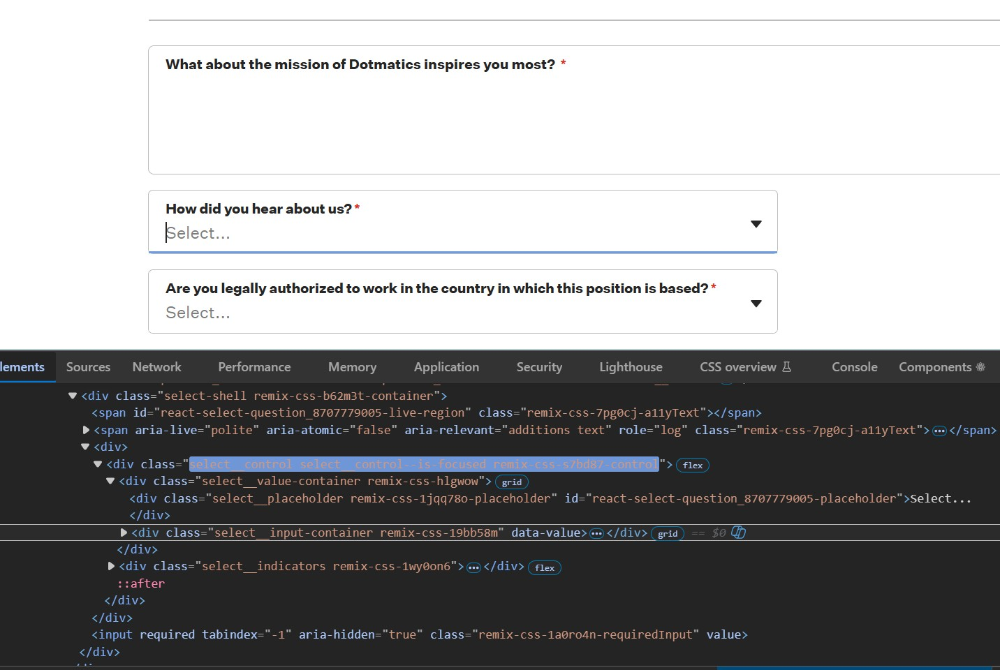
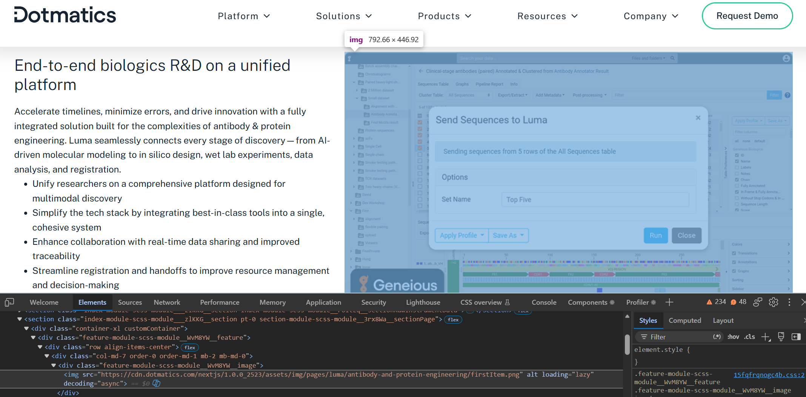

# Playwright Testing for Dotmatics' Website

This Playwright automation test framework uses TypeScript to automate [Dotmatics](https://www.dotmatics.com/)

## Aim/Goals
- Develop Playwright automation framework using TypeScript.
- Demonstrate use of POM (Page Object Model) to show readable, maintainable and scalable code.
- Create UI tests to verify core webpages are present and functional.
- Integrate CI/CD workflow using GitHub Actions.
- Development timeboxed to one working week.


## Setup Instructions

Steps on how to install dependencies and execute the tests.
1. Ensure the following are installed:
   - [Node.js](https://nodejs.org/) (v18 or higher)
   - [npm](https://www.npmjs.com/)
   - [Git](https://git-scm.com/)

2. Clone this [repository](https://github.com/pendragon888/DotmaticsWebsite) into your local machine using the terminal (Mac), CMD (Windows), or a GUI tool like SourceTree.

3. Install the node dependencies:

    ```bash
    npm install
    npm install dotenv
    ```

4. To install the playwright browsers:

    ```bash
    npx playwright install
    ```

5. To run all the tests in the directory:

    ```bash
    npx playwright test
    ```


    or to see tests in UI mode
    ```bash
    npx playwright test --ui
    ```

6. To run tests from a specific spec file:

    ```bash
    npx playwright test contact-us.spec.ts
    ```

## Areas of Interest / Suggested Improvements

### data-testid

- Adding the 'data-testid' HTML attribute to uniquely identified elements in the UI would contribute towards the reliability, maintainance, stability and scalability of the automated tests. One area that was tricky to locate elements was on the Job Application Form.



### Missing alt-text from images
- A few alt-text descriptions to images are missing such as on the Antibody & Protein Engineering webpage images for the Luma platform. Adding this would help towards accessibility compliance.




## Testing Framework Developed By

**Kevin D**

QA Automation Engineer
